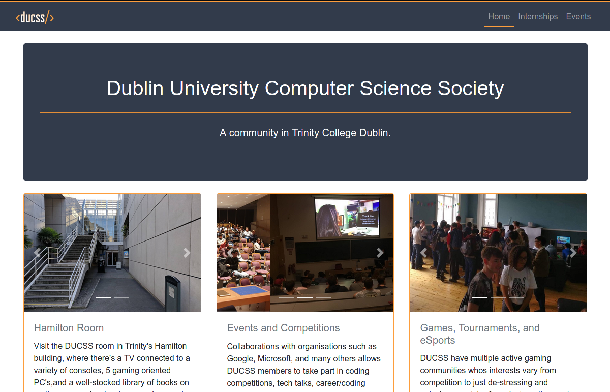

# ducss-site

[](https://ducss.ie)

DUCSS website repository

## Table of contents
1. [Getting started](#getting-started)
    1. [Running the website locally](#running-the-website-locally)
        1. [Prerequisites](#prerequisites)
        1. [Running the website](#running-the-website)
    1. [Deploying to production](#deploying-to-production)
        1. [Prerequisites](#prerequisites-1)
        1. [Running the website](#running-the-website-1)

## Getting started

### Running the website locally

#### Prerequisites

You will need to have installed:

1. Docker

#### Running the website

1. Clone the repo
    ```
    git clone https://github.com/DUCSS/ducss-site.git
    ```
1. Navigate into the cloned GitHub repository
    ```
    cd ducss-site
    ```
1. Copy `.env.example` to `.env` and change `HOST`, `PORT`, `CORS_ORIGIN_URL`, `MONGODB_PORT`, `MONGODB_URL`, `SERVER_PORT_HTTP`, `SERVER_PORT_HTTPS`, `USERNAME` and `PASSWORD`
1. Run the start script using `./start_dev.sh`

The local website will be hosted on [`http://localhost:<PORT>`](http://localhost:<PORT>) and the api will be hosted on [`http://localhost:<SERVER_PORT_HTTP>`](http://localhost:<SERVER_PORT_HTTP>)

### Deploying to production

#### Prerequisites

You will need to have installed:

1. Docker
1. NGINX
1. Certbot

#### Running the website

1. Get a certificate for the domain `ducss.ie`, instructions are found [here](https://certbot.eff.org/lets-encrypt/ubuntubionic-nginx) 
1. Copy `nginx.conf` to `/etc/nginx/nginx.conf`
    ```
    cp ./nginx.conf /etc/nginx/nginx.conf
    ```
1. Clone the repo
    ```
    git clone https://github.com/DUCSS/ducss-site.git
    ```
1. Navigate into the cloned GitHub repository
    ```
    cd ducss-site
    ```
1. Copy `.env.example` to `.env` and change `HOST`, `PORT`, `CORS_ORIGIN_URL`, `MONGODB_PORT`, `MONGODB_URL`, `SERVER_PORT_HTTP`, `SERVER_PORT_HTTPS`, `USERNAME` and `PASSWORD`
1. Run the start script using `./start.sh`

The website will be hosted on [`https://ducss.ie`](https://ducss.ie) and the api will be hosted on [`https://ducss.ie:<SERVER_PORT_HTTPS>`](https://ducss.ie:<SERVER_PORT_HTTPS>)
